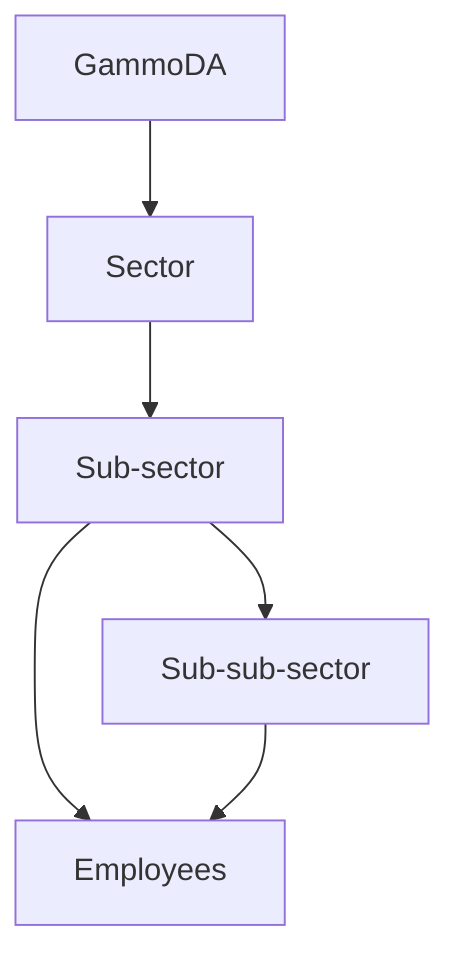
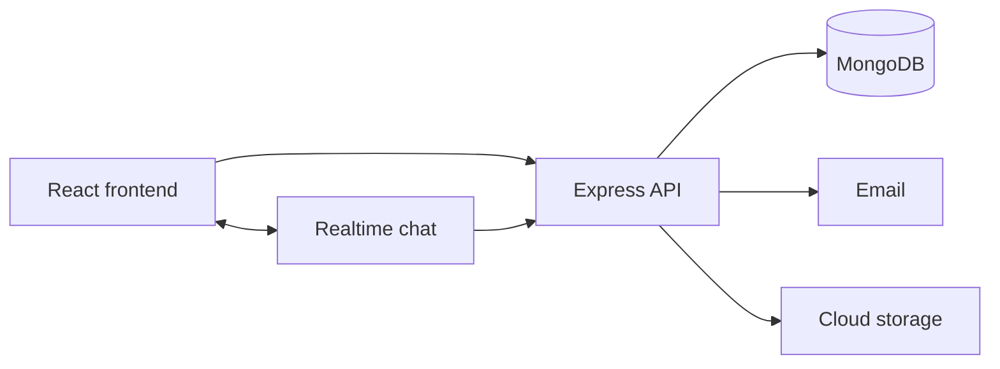

<div align="center">


# 🏛️ GammoDA HR Platform

### Gamo Development Association — Human Resource Management System

**One portal for the organization:** employees, sectors & units, attendance, leave, payroll, advances, recruitment, devices, chat, ID cards, and more — with English & Amharic UI and role-based access.

[](https://react.dev/)
[](https://vitejs.dev/)
[](https://nodejs.org/)
[](https://www.mongodb.com/)
[](https://socket.io/)
[](#-internationalization)

<br />


<br />

[Features](#-what-the-platform-covers) ·
[Org structure](#-organization-structure) ·
[Quick start](#-quick-start) ·
[Roles](#-roles-at-a-glance) ·
[License](#-license)

</div>

---

## ✨ Overview

**GammoDA HR** is the people-operations platform for the **Gamo Development Association**. It brings day-to-day HR into one web app that mirrors how the organization is structured — from top sectors down to nested units — so each role only works with the people and data they should see.

| | |
|--|--|
| 🎯 **Purpose** | Digitize HR for HQ and distributed units |
| 👥 **Users** | Admins, HR, sector & unit leaders, and employees |
| 🌍 **Languages** | English + Amharic (አማርኛ) |
| 🧾 **Payroll** | GaDA salary payment workflow with payslips & exports |
| 🪪 **Identity** | Digital employee ID card with print / PDF |

> 🔒 **Internal setup** (demo logins, env secrets, API maps, seed notes) lives in [`docs/INTERNAL.md`](./docs/INTERNAL.md) for maintainers — **do not publish credentials**.

---

## 👨‍💻 Author & credit

**Created, developed, and maintained by [Metasebiyaw Asfaw](https://github.com/chapi1234) ([@chapi1234](https://github.com/chapi1234)).**

All project authorship and engineering credit belong to the repository owner unless otherwise noted in a commit or contribution record.

| | |
|--|--|
| **Author** | Metasebiyaw Asfaw |
| **GitHub** | [chapi1234](https://github.com/chapi1234) |
| **Repository** | [GDA-HR-Platform](https://github.com/chapi1234/GDA-HR-Platform) |
| **Client / org** | Gamo Development Association (GammoDA) |

---

## 📦 What the platform covers

| Area | Capabilities |
|------|----------------|
| **👥 Employees** | Create & manage staff, roles, unit placement, profiles, photos, Excel export |
| **🏢 Sectors & units** | Full org tree: sector → sub-sector → sub-sub-sector |
| **🛠️ Admin Console** | Privileged organization administration |
| **⏰ Attendance** | Check-in / out, late tracking, team roster, reports & Excel export |
| **🏖️ Leave** | Request, approve/reject, email notifications |
| **💰 Payroll** | GaDA salary sheet, approvals, mark paid, batch tools, month controls |
| **📄 Payslips** | Generated after payroll approval; employee & HR views |
| **💸 Salary advances** | Full or installment repayment, linked to payroll |
| **🧑‍💼 Recruitment** | Jobs and candidate pipeline |
| **💻 Devices** | Company inventory, assignment, employee “my devices” view |
| **🪪 My ID** | Digital employee ID from official template |
| **💬 Chat** | Realtime messaging (DMs & channels) |
| **📅 Calendar** | Events and announcements |
| **🎯 Goals** | Performance goal tracking |
| **👤 Profile & settings** | Personal profile, language, appearance preferences |
| **🔔 Notifications** | In-app and email alerts for key HR events |

---

## 🏢 Organization structure

```text
Organization (GammoDA)
 └── Sector
      └── Sub-sector (unit)
           └── Sub-sub-sector (nested unit)
```

| Level | Typical leader |
|-------|----------------|
| Sector | Sector Lead |
| Sub-sector | Manager |
| Sub-sub-sector | Unit Manager |

**Sectors** module supports viewing the tree, creating/editing units, and placing employees under the right branch. Access is scoped so leaders only see their part of the organization.



---

## 👥 Employee management (highlights)

- Add, update, and remove staff (permission-gated)
- Assign **role** and **organizational unit**
- Profile photo, employment status, and related HR fields
- Search / filter and **Excel export**
- Welcome email when mail is configured

Detailed field lists, capability matrices, and payroll math are kept in maintainer docs — not in this public README.

---

## 🏗️ Architecture (high level)



| Layer | Stack |
|-------|--------|
| Frontend | React, Vite, Tailwind, shadcn/ui, React Router |
| Backend | Node.js, Express, Mongoose, JWT |
| Data & media | MongoDB, Cloudinary |
| Realtime | Socket.IO |

---

## 📁 Project layout

```text
gammoda-HR-System/
├── Backend/          # API, models, email, realtime
├── Frontend/         # React SPA
├── docs/
│   ├── readme/       # Public README images
│   └── INTERNAL.md   # Maintainer-only setup (credentials, APIs)
├── roles.md          # Role & permission guide (no passwords)
└── README.md         # This file
```

---

## ⚡ Quick start

### Prerequisites

- Node.js 18+ (20 LTS recommended)
- MongoDB
- Cloudinary + SMTP accounts for media and email

### Run locally

```bash
git clone https://github.com/chapi1234/GDA-HR-Platform.git
cd GDA-HR-Platform

# Backend
cd Backend
npm install
# Copy env template from docs/INTERNAL.md — never commit real secrets
npm run seed:sectors   # optional: demo org tree
npm run dev

# Frontend (new terminal)
cd Frontend
npm install
# Set VITE_API_URL to your API base (see INTERNAL.md)
npm run dev
```

Open the Vite URL shown in the terminal (typically a local `localhost` port).

<div align="center">

</div>

---

## 🎭 Roles at a glance

| Role | Scope (summary) |
|------|------------------|
| Super Admin | Whole organization |
| Org Admin | Org accounts & structure |
| Org HR | Central people operations & payroll approval |
| Sector Lead | One top sector |
| Manager | One sub-sector / unit |
| Unit Manager | One nested unit |
| Employee | Self-service |

Full permissions and payroll workflow rules: **[`roles.md`](./roles.md)**  
Demo credentials & env templates: **[`docs/INTERNAL.md`](./docs/INTERNAL.md)** (maintainers only)

---

## 🌐 Internationalization

| Language | Location |
|----------|----------|
| English | `Frontend/src/i18n/locales/en.js` |
| Amharic | `Frontend/src/i18n/locales/am.js` |

Switch language in **Settings**.

---

## 🛠️ Scripts

| Where | Command | Purpose |
|-------|---------|---------|
| Backend | `npm run dev` | Start API |
| Backend | `npm run seed:sectors` | Seed org tree (see INTERNAL for accounts) |
| Frontend | `npm run dev` | Start SPA |
| Frontend | `npm run build` | Production build |

---

## 🤝 Contributing

1. Branch from `main`
2. Keep PRs focused
3. Never commit `.env`, secrets, or credentials
4. Update `roles.md` when changing permissions
5. Keep sensitive setup in `docs/INTERNAL.md` — do not move passwords into the public README

---

## 📄 License

Private software built for **Gamo Development Association**.  
**Copyright © Metasebiyaw Asfaw (@chapi1234).** All rights reserved unless otherwise agreed with the author.

---

<div align="center">


### GammoDA HR Platform

**Author: [Metasebiyaw Asfaw](https://github.com/chapi1234) · [@chapi1234](https://github.com/chapi1234)**

**Employees · Sectors · Attendance · Leave · Payroll · Advances · Recruitment · Devices · Chat · ID Cards**

<br />

`Built by Metasebiyaw Asfaw for Gamo Development Association`

</div>
